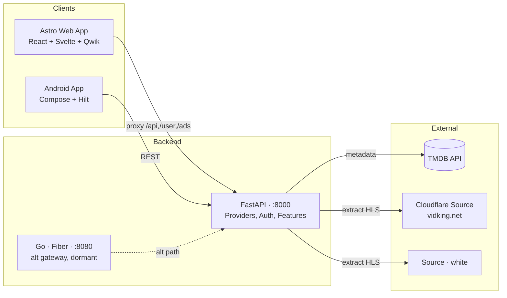

<div align="center">

# 🎬 Watchfy

**A cinematic, multi-source streaming platform with a beautiful web app, a playback
API, and a native Android client.**

[](#)
[](./backend)
[](./android)
[](https://www.python.org)
[](https://nodejs.org)
[](#license)

> Built for people who want a Netflix-grade experience on top of public media
> sources — with first-class HLS playback, resume-watching, parental controls, and
> a hand-tuned cinematic UI.

</div>

---

## ✨ What is Watchfy?

Watchfy is a streaming aggregator and player. It pulls metadata from **TMDB**, fetches
playable HLS sources from a configurable mix of upstream providers (including
Cloudflare-protected ones via headless Chromium), and serves a **cinematic web app**
and a **native Android client** on top of it.

It's not a scraper you run once — it's a full platform with auth, profiles, watch
history, parental controls, analytics, and a proper deployment story.

---

## 🚀 Features

### Playback & content
- 🎞 **Multi-source HLS** with two providers (`black` for Cloudflare-locked sources,
  `white` for the easier ones) and a generic proxy fallback
- 🔁 **HLS manifest rewriting + segment proxying** so CORS-locked CDNs play everywhere
- ⏯ **Continue Watching** with per-episode TV progress
- 📥 **MP4 download** streaming with range support
- 🪪 **Subtitle** discovery per source
- 🔥 **FFmpeg remux** pipeline (requires system `ffmpeg`)

### Product
- 🔐 **Auth & profiles** with sessions
- 👨‍👩‍👧 **Parental controls** with per-user settings
- 📊 **Analytics** + ad-placement hooks
- ❤️ **My List** on the Android side, syncing through the API
- 🪞 **Cinematic UI** — glass morphism, Framer Motion, ATSC-safe colors

### Engineering
- 🐍 **FastAPI** backend with proper lifespan management, structured JSON logging,
  per-request latency tracking, and security headers
- 🐹 **Go + Fiber** gateway in `backend/gateway/` (alternative, not yet wired into
  `start.sh`)
- 🛰 **Patchright + Scrapling** for Cloudflare bypass (no Puppeteer)
- 📦 **pnpm workspaces** + four shared frontend packages
- 🤖 **Android** — Kotlin, Jetpack Compose, Hilt DI, Room, Material 3

---

## 🏗 Architecture



In production today the **Python backend is the only live service**. The Go gateway
is a parallel implementation kept for experimentation; see
[Roadmap](#-roadmap) for the plan to merge or remove it.

---

## 🧰 Tech stack

| Layer | Tech |
|---|---|
| Web frontend | Astro 4 (SSR) · React 19 · Svelte 5 · Qwik islands · Tailwind CSS · hls.js · Framer Motion |
| Frontend packages | pnpm workspaces: `@watchfy/animations`, `@watchfy/design-tokens`, `@watchfy/shared-types`, `@watchfy/ui-primitives` |
| Streaming backend | Python 3.11+ · FastAPI · uvicorn · httpx · Patchright + Scrapling · FFmpeg |
| Alt gateway | Go 1.22 · Fiber v2 |
| Mobile | Kotlin · Jetpack Compose · Hilt · Room · Material 3 |
| Tooling | pnpm 8 · Gradle KTS · ruff-style Python |

---

## 📂 Project structure

```
Watchfy/
├── frontend/                       Astro 4 web app
│   ├── astro.config.mjs            SSR config + Vite → backend proxy
│   ├── src/
│   │   ├── pages/                  File-based routes (home, movies, tv, search, watch/...)
│   │   ├── components/             Astro / React / Svelte / Qwik components
│   │   ├── layouts/
│   │   └── lib/
│   └── packages/                   pnpm workspace packages
│       ├── animations/
│       ├── design-tokens/
│       ├── shared-types/
│       └── ui-primitives/
├── backend/                        Python FastAPI service (the live backend)
│   ├── app/
│   │   ├── main.py                 FastAPI app — providers + feature routers
│   │   ├── api/
│   │   │   ├── providers/black.py  Cloudflare source (Patchright)
│   │   │   ├── providers/white.py  Easier source
│   │   │   ├── proxy.py            Generic proxy
│   │   │   ├── ffmpeg_remux.py
│   │   │   └── tmdb.py
│   │   ├── core/extractors/        HLS / RC4 / provider extraction
│   │   ├── lib/
│   │   └── middleware/
│   ├── auth.py · ads.py · analytics.py · continue_watching.py
│   ├── parental_controls.py · subtitles.py · tmdb.py · user_features.py
│   ├── requirements.txt
│   └── gateway/                    Go + Fiber (dormant — see Roadmap)
├── android/                        Native Android client
│   └── app/src/main/java/com/watchfy/app/
│       ├── data/local              Room: continue-watching, my-list
│       ├── data/remote             DTOs, Repositories
│       ├── data/repository
│       ├── di/                     Hilt modules
│       ├── domain/model
│       ├── navigation/             Compose NavGraph
│       └── ui/screens/             browse · details · movies · search · tv · watch
├── scripts/                        start.sh, helper utilities
├── setup.sh                        Python venv + deps + patchright chromium + .env
├── health_check.sh                 (currently has wrong ports — see Known issues)
├── Makefile                        alt runner (npm + uvicorn black:app)
└── pnpm-workspace.yaml
```

---

## ⚡ Quick start

You need **Python 3.11+**, **Node 18+**, and **pnpm 8**. FFmpeg and the Patchright
Chromium install are optional but recommended.

```bash
# 1. Clone
git clone https://github.com/BlusceLabs/Watchfy.git
cd Watchfy

# 2. Bootstrap (creates .venv, installs Python deps, installs Chromium for Cloudflare bypass, copies .env)
./setup.sh

# 3. Add your TMDB API key
$EDITOR backend/.env      # set TMDB_API_KEY=...

# 4. Install frontend deps
cd frontend && pnpm install && cd ..

# 5. Run backend + frontend together
./start.sh
```

Open:

- 🌐 Web app → http://localhost:4321
- 📚 API docs → http://localhost:8000/api/docs
- 💓 Health → http://localhost:8000/api/health

`start.sh` tails logs to `/tmp/watchfy-logs/`.

### Run services individually

```bash
# Backend
source .venv/bin/activate
cd backend && uvicorn main:app --reload --port 8000

# Frontend
cd frontend && pnpm dev --port 4321

# Alt gateway (experimental)
cd backend/gateway && go run ./cmd/api    # → :8080
```

### Docker

```bash
./setup.sh --docker      # docker compose build + up
```

---

## 🧩 Providers

Providers are pluggable source adapters mounted in `app/main.py`. The current two:

| Provider | Source | When it triggers | Notes |
|---|---|---|---|
| `black` | vidking.net + CDNs (speedsterwave, cloudnestra, ...) | Default for new requests | Uses **Patchright** (Playwright fork) to bypass Cloudflare. Hosts are allowlisted in `black.py` (`ALLOWED_BLACK_HOSTS`). Caches sources for `BLACK_CACHE_TTL` (15 min default), stale-tolerant up to 30 min. |
| `white` | Simpler upstream | Fallback | No headless browser; cheaper per request. |

### Adding a provider

1. Create `backend/app/api/providers/<name>.py` exposing a FastAPI `router`.
2. Create `backend/app/core/extractors/<name>.py` with the actual extraction logic.
3. Wire the router into `app/main.py`.
4. Add it to the allowlist in `app/api/proxy.py` if it needs segment proxying.

---

## 🔌 API surface

Browseable at **`/api/docs`** (Swagger UI) and **`/api/redoc`** once the backend is
running. The key route groups:

| Group | Prefix | Notes |
|---|---|---|
| Health / meta | `/api/health`, `/api/ready`, `/` | Uptime, version, hostname |
| Providers | `/api/black/*`, `/api/white/*` | Source, HLS proxy, segment proxy, prewarm, refresh, download |
| Proxy | `/api/proxy/*` | Generic upstream proxy |
| FFmpeg | `/api/ffmpeg/*` | Remux helpers |
| TMDB | `/api/tmdb/*` | Metadata bridge |
| Auth | `/api/auth/*` | Session-based |
| Continue Watching | `/continue-watching` | Progress tracking |
| Parental | `/parental/*` | Per-user settings |
| Ads | `/ads/*` | Ad-placement hooks |
| Analytics | `/analytics/*` | Event ingestion |
| User features | `/user/*` | Profile, list, prefs |

---

## 📱 Android client

```bash
cd android
./gradlew assembleDebug          # → app/build/outputs/apk/debug/app-debug.apk
./gradlew installDebug
```

- **Min SDK:** 26 · **Target SDK:** 35
- **Backend:** defaults to `https://api.jabez.co.ke` (override via `BACKEND_URL`
  in `app/build.gradle.kts`)
- Screens: Browse · Movies · TV Shows · Search · Details · Watch
- Local persistence: Room (Continue Watching, My List)

> ⚠️ The release signing config in `android/app/build.gradle.kts` currently
> falls back to a default password of `"android"` and uses the committed
> `watchfy-release.jks` keystore. **See [Security](#-security) before shipping.**

---

## 🔐 Environment variables

### `backend/.env`

| Var | Required | Default | Purpose |
|---|---|---|---|
| `TMDB_API_KEY` | ✅ | — | https://www.themoviedb.org/settings/api |
| `VIDKING_EXTRACTOR_URL` | — | `http://localhost:8000` | Used by some upstream calls |
| `ALLOWED_ORIGINS` | — | `*` | Comma-separated CORS allowlist |
| `LOG_LEVEL` | — | `INFO` | Root log level |
| `BLACK_CACHE_TTL` | — | `900` (15 min) | Fresh source cache |
| `BLACK_STALE_TTL` | — | `1800` (30 min) | Stale-while-revalidate window |
| `REDIS_URL` | — | unset | Optional Redis cache |
| `SSL_KEYFILE` / `SSL_CERTFILE` | — | unset | HTTPS via `run.py` |

### `frontend/.env` (optional, prod-only)

```ini
BACKEND_URL=https://api.example.com
```

In dev the Astro Vite proxy already forwards `/api`, `/continue-watching`, `/user`,
`/ads`, and `/analytics` to `http://localhost:8000`.

---

## 🛠 Deployment

Two paths:

- **`./setup.sh --docker`** — uses `docker compose` to bring up the full stack
  (frontend SSR + backend). Nginx is in `backend/nginx/` for SSL termination.
- **Bare metal** — `start.sh` is systemd-friendly; just run it under a process
  manager and point a reverse proxy at the two ports.

For production:
- Set `ALLOWED_ORIGINS` to your real frontend origin(s).
- Front a CDN at the HLS segment proxy (`/api/black/proxy/seg/*`) — segments are
  the hot path.
- Mount a persistent volume for `ruvector.db` if you use the local SQLite cache.

---

## 🩺 Troubleshooting

| Symptom | Likely cause | Fix |
|---|---|---|
| `python3 -m patchright install` fails | Network / missing libs | `apt install -y libnss3 libatk1.0-0 libatk-bridge2.0-0 libxkbcommon0 libgbm1` then retry |
| `pydantic` version errors | Old venv | `rm -rf .venv && ./setup.sh` |
| `ffmpeg` not found | Missing binary | `apt install ffmpeg` (or `brew install ffmpeg`) — only needed for remux/download |
| Astro dev server won't start | Node < 18 or pnpm < 8 | `node -v`, `pnpm -v` |
| Cloudflare still blocking `black` provider | Patchright browser not installed | `python3 -m patchright install chromium` |
| `health_check.sh` says everything is fine but it isn't | It probes wrong ports | It currently checks `:3000` and `/health` instead of `:4321` and `/api/health`. See Known issues. |
| Port 4321 already in use | Another dev server | `pnpm dev --port 4322` and update the Vite proxy in `astro.config.mjs` |

---

## 🛣 Roadmap

- [ ] **Wire the Go gateway** into `start.sh` (or remove it) — currently dead code.
- [ ] **Unify the start scripts** — `Makefile` and `start.sh` disagree on package
      manager (npm vs pnpm) and uvicorn module (`black:app` vs `main:app`).
- [ ] **Fix `health_check.sh`** to probe the right ports and paths.
- [ ] **Move secrets out of the repo** — the Android `watchfy-release.jks` and the
      13 MB pre-built `backend/gateway/server` binary should not be in source
      control.
- [ ] **Restructure the pnpm workspace** so `frontend/` lives under `apps/web/` to
      match the CI's `pnpm --filter web build`.
- [ ] **Real test suite** — backend has `pytest`-style imports but no test
      directory; Android has no instrumentation tests yet.
- [ ] **Add a `LICENSE`** file (MIT? Apache-2.0?).
- [ ] **Provider plugin manifest** so new sources are config-driven instead of
      code-driven.

---

## 🚨 Known issues

These are real and unfixed in the current code. PRs welcome.

- `pkg_shim.py.bak` is committed in `backend/`.
- `agentdb.rvf` and `ruvector.db` (1.5 MB SQLite file) are committed at the repo
  root. `*.db` is in `.gitignore` but `ruvector.db` was committed before that.
- `backend/gateway/server` is a 13 MB pre-built Linux binary — won't run on macOS
  or Windows. Build from source.
- The Android release keystore (`watchfy-release.jks`) is committed, and the
  default signing config falls back to password `"android"`. **Rotate before any
  public release.**
- `Makefile`'s `backend` target runs `uvicorn black:app` — that file is now a
  shim and the real entry point is `uvicorn main:app` (which is itself a shim
  to `app.main:app`). The shim chain works, but it's confusing.

---

## 🔒 Security

- The `black` provider uses Patchright/Scrapling to bypass Cloudflare browser
  checks. Use it only against sources you have the right to consume.
- The committed Android release keystore (`watchfy-release.jks`) is a **demo
  keystore**. Generate a new one and remove the file from the repo before any
  production release.
- Don't commit your real `TMDB_API_KEY` — it's only read from `backend/.env`,
  which is gitignored.

If you find a security issue, please email **security@blusce.dev** (or open a
private advisory) — do not file a public issue.

---

## 🤝 Contributing

1. Fork & branch from `main` (`feat/<short-name>` or `fix/<short-name>`).
2. Backend: keep `ruff` clean; match the existing docstring style.
3. Frontend: respect the per-framework island split (don't put React hooks in
   `.astro` files, etc.).
4. Run the relevant service locally before opening the PR.
5. For changes to the providers, include the upstream URL you tested against.

---

## 📄 License

TBD — no `LICENSE` file is committed yet. See [Roadmap](#-roadmap).

---

## 🙏 Acknowledgments

- [TMDB](https://www.themoviedb.org) — metadata
- [Fiber](https://gofiber.io), [FastAPI](https://fastapi.tiangolo.com),
  [Astro](https://astro.build) — the frameworks that make this stack fun
- [Patchright](https://github.com/nicbarker/patchright) and
  [Scrapling](https://github.com/D4Vinci/Scrapling) — Cloudflare bypass tooling
- Everyone who's reported a bad source, a wrong port, or a missing env var 🙌
